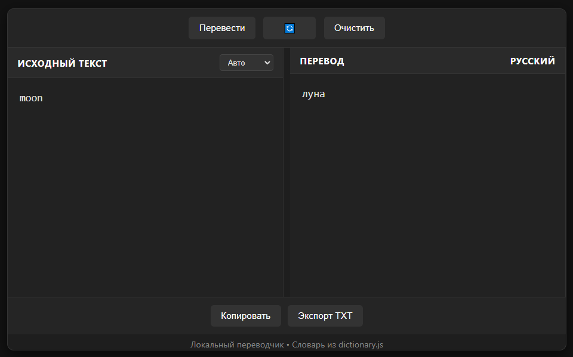

# 🌐 Локальный переводчик со словарём 8000+ слов
**Простой, стильный и полностью локальный переводчик между русским и английским языками — без интернета, без рекламы, без лишнего.**

💡 Словарь содержит более 8000 пар слов — от базовых фраз до повседневной лексики. Работает даже в офлайне!

---

## ✨ Особенности

✅ Регистронезависимый поиск: Moon, moon, MOON — всё работает одинаково
✅ Автоопределение языка: просто введите текст — система сама поймёт, с какого языка переводить
✅ Мгновенный перевод через встроенный словарь (dictionary.js)
✅ Обмен языками одним кликом: 🔄
✅ Копировать, экспорт в TXT, очистить — всё под рукой
✅ Тёмная тема с плавными переходами, округлыми углами и современным дизайном
✅ 100% локальный: работает на localhost, не требует API, не отправляет данные
✅ Поддержка HTML/JS — легко интегрировать в любой проект

---

## 📦 Как использовать

✅ Скачайте весь репозиторий или скопируйте файлы:
✅ translator.html — основной интерфейс
✅ dictionary.js — словарь из 8000+ слов
✅ Откройте translator.html в браузере (Chrome, Edge, Firefox — всё работает).
✅ Начните печатать — перевод появится автоматически через 0.5 секунды.
✅ Или нажмите "Перевести" вручную.
✅ Нажмите "🔄", чтобы поменять языки местами.
✅ Нажмите "Копировать", чтобы сохранить результат.
✅ Нажмите "Экспорт TXT", чтобы сохранить перевод в файл.
---

## 📚 О словаре

Словарь dictionary.js содержит более 8000 пар английских и русских слов — от hello / привет до bureaucracy / бюрократия.
Он оптимизирован для повседневного использования:

✅ Часто употребляемые слова
✅ Разговорная лексика
✅ Ключевые термины из IT, финансов, быта

Словарь структурирован как объект JavaScript.

Вы можете легко расширить его — просто добавьте пары в файл.

## 💡 Для разработчиков
Идеально подходит для локальных приложений, образовательных проектов, офлайн-инструментов.
Поддерживает Prism.js, autosave, multi-column layouts — легко интегрируется в другие UI.
Не использует базы данных, куки или серверы — 100% клиентский код.

🛠 Требования

Браузер с поддержкой navigator.clipboard (Chrome, Edge, Firefox)
Нет необходимости в сервере — работает с file://
Рекомендуется: Segoe UI или Arial — шрифты по умолчанию

❤️ Автор
Создано с любовью для тех, кто ценит простоту, конфиденциальность и красивый интерфейс.
Спасибо, что используете! 🙏

Если захотите расширить словарь — создайте Pull Request!